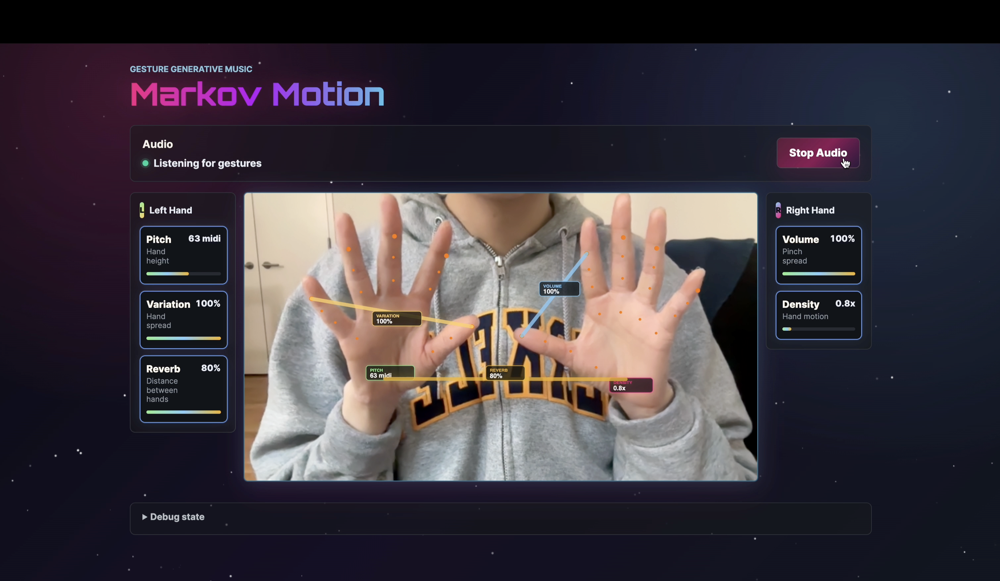
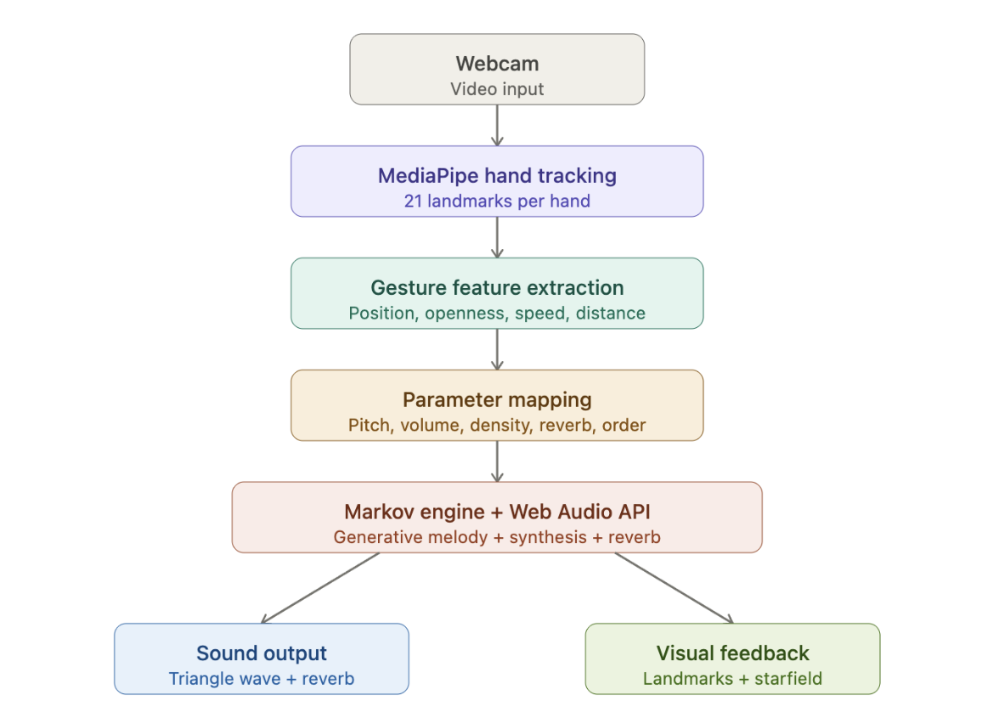
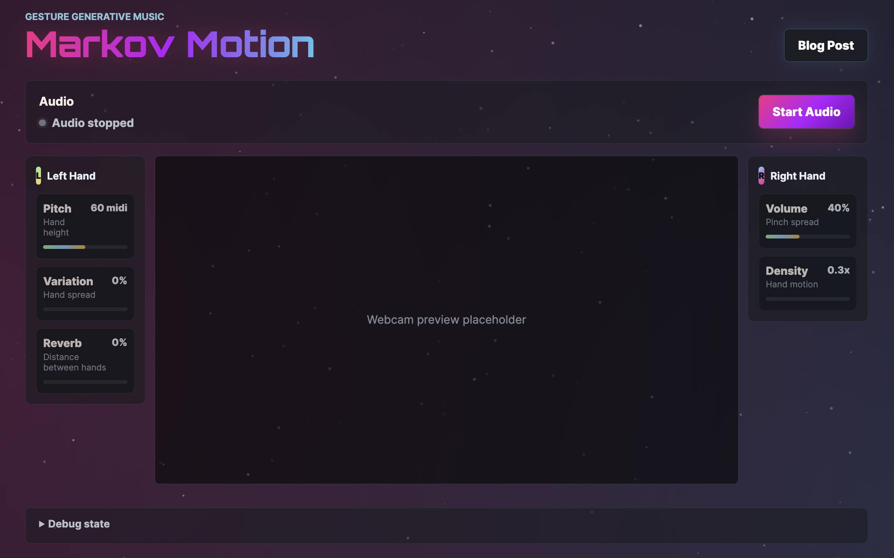

# Markov Motion

## A Gesture-Controlled Generative Music Instrument

**By Zhenni Yue & Natalie Kim**  



## Introduction

What if you could conduct a generative melody simply by opening and closing your hand?

Markov Motion is a browser-based generative music instrument that transforms webcam-tracked hand gestures into real-time musical behavior. Rather than mapping gestures directly to isolated sound parameters like pitch or volume, we designed a system where hand movements influence the behavior of a Markov chain, a probabilistic model that generates melodies by learning transition patterns from a training sequence.

The result is a more indirect and collaborative form of interaction: you are not directly playing notes, you are shaping how the system thinks.

Built with MediaPipe Hands, the Web Audio API, and a custom Markov engine, the project sits at the intersection of computer vision, automated composition, audio synthesis, and interactive instrument design.

## Live Interaction

[Watch the live interaction demo on YouTube](https://www.youtube.com/watch?v=LQrUovuigN4)

## System Pipeline

The system processes information through five stages:



1. Webcam input
2. Hand tracking with MediaPipe
3. Gesture feature extraction
4. Gesture-to-music parameter mapping
5. Markov generation, Web Audio synthesis, and visual feedback

Each stage is isolated into its own module, making the architecture modular and extensible. The Markov engine itself does not know anything about hand tracking. It only reads from a shared state object written by the gesture-mapping layer.

This separation allowed us to independently experiment with gesture detection, audio synthesis, and generative logic throughout development.

## Hand Tracking with MediaPipe

To capture gesture input, we used MediaPipe Hands, a real-time computer vision framework capable of detecting and tracking 21 hand landmarks per hand directly from a webcam feed.

Each landmark returns normalized `(x, y, z)` coordinates relative to the video frame. From these raw coordinates, we extract several higher-level gesture features:

- Vertical position of the left hand
- Left hand openness
- Right hand pinch spread
- Right hand movement velocity
- Distance between both hands

These features are continuously updated and written into a shared application state that drives both the audio and visual systems.

One challenge we encountered involved MediaPipe's handedness labels. MediaPipe labels hands relative to the camera rather than the user, meaning the API's "Left" hand corresponds to the user's right hand when facing the webcam.

To solve this, we mirrored the webcam feed horizontally and remapped the handedness internally so the interaction feels natural and intuitive to the performer.

## Gesture-to-Parameter Mapping

Rather than assigning gestures arbitrarily, we deliberately separated structural control from expressive control across the two hands.

| Gesture | Musical Parameter |
|---|---|
| Left hand height | Pitch range |
| Left hand openness | Markov order / variation |
| Right hand pinch spread | Volume |
| Right hand movement speed | Note density |
| Distance between both hands | Reverb amount |

The left hand shapes the generative structure of the music, while the right hand controls dynamics and texture.

This separation made the instrument easier to learn and more expressive to perform. A user can hold a stable left hand to preserve melodic structure while using the right hand to sculpt intensity and rhythm in real time.



## Markov-Based Generative System

At the core of the project is a multi-order Markov chain trained on a short melody sequence: Twinkle Twinkle Little Star.

We deliberately chose this melody because it is simple and immediately recognizable, making changes in Markov order easy to hear.

The system builds transition matrices at multiple orders:

- Order 1: highly random melodic behavior
- Order 2: partially structured patterns
- Order 3: recognizable melodic continuity
- Order 0: direct playback of the original melody sequence

The openness of the left hand determines which mode is active. As the user slowly closes their fist, the melody transitions from chaotic and unpredictable to increasingly structured and recognizable.

This means the user is not controlling individual notes directly. They are controlling how much the system "remembers."

One technical challenge involved handling missing transitions in higher-order matrices. Since the training melody is short, certain note combinations never occur.

To address this, we implemented a fallback strategy that progressively searches lower-order matrices until a valid transition is found. If no valid transition exists, the system falls back to a random note selection.

## Web Audio Synthesis

All audio generation and scheduling were implemented using the Web Audio API.

Each generated note creates an `OscillatorNode` and a `GainNode`. We chose a triangle wave oscillator because it produces a warmer and more musical tone compared to a pure sine wave. A secondary oscillator one octave lower is layered underneath at lower gain to add depth and fullness.

For timing, we implemented a lookahead scheduler: a `setInterval` fires every 50ms, and notes within the next 200ms window are scheduled ahead of time using the `AudioContext` clock.

This approach keeps playback stable and avoids timing jitter caused by JavaScript's event loop.

Reverb was implemented using a `ConvolverNode` with a synthetic impulse response generated from exponentially decaying noise.

The dry/wet reverb mix is controlled by the distance between both hands: spreading the hands apart increases spatial depth and ambience.

## Visual System

The visual layer has two primary goals: show what the system is detecting and make the generative state visible to the performer.

The webcam overlay renders 21 hand landmarks, connection lines, gesture indicators, and parameter badges. Each controlled parameter, including pitch, variation, volume, density, and reverb, is displayed directly near the related gesture.

The background is an animated starfield that reacts to the music system itself.

- Star brightness increases with volume
- Motion speed increases with note density
- Star count increases as the left hand closes

When fully open, the background contains approximately 200 stars. When fully closed, it increases to roughly 500 stars.

This ties the visual environment directly to the generative state of the music, making the system feel alive even when no hands are present.

## Challenges and Reflections

One thing we learned is that probabilistic control behaves very differently from direct parameter control.

When turning a knob on a traditional synthesizer, the result is immediate and deterministic. In contrast, shifting a Markov order changes probability distributions, meaning the musical behavior evolves gradually over time rather than changing instantly.

The melody does not suddenly snap into a new state. It drifts toward one.

This made the interaction feel more like conducting than traditional note-playing, which aligned strongly with our original design goal of creating an indirect and collaborative musical instrument.

Another challenge involved making changes in Markov order perceptible enough to users in real time. Lower-order chains sometimes sounded too chaotic, while higher-order chains became repetitive too quickly.

Using a highly recognizable training melody helped make these structural changes more audible and understandable during performance.

## Conclusion

Markov Motion began as an experiment in gesture-controlled generative music, but evolved into a study of indirect interaction and probabilistic musical behavior. Instead of treating gestures as direct commands, we explored how human movement could shape the internal behavior of a generative system over time.

By combining computer vision, Markov-based composition, Web Audio synthesis, and reactive visuals, we created an instrument that feels less like pressing buttons and more like conducting a living musical process.

More broadly, the project challenged us to think about interaction design not only in terms of control, but also in terms of collaboration between human intention and computational systems.

## Running the Project

```bash
npm install
npm run dev
npm run build
npm run preview
```

## Project Structure

```text
src/
  main.js
  camera.js
  handTracker.js
  gestureFeatures.js
  gestureMapping.js
  markovEngine.js
  scheduler.js
  audioEngine.js
  visuals.js
  style.css
index.html
```

## Module Responsibilities

- `src/main.js` defines shared app state, initializes modules, wires UI events, and updates the debug panel.
- `src/camera.js` owns webcam startup and shutdown.
- `src/handTracker.js` integrates MediaPipe hand tracking.
- `src/gestureFeatures.js` reduces raw landmarks into gesture features.
- `src/gestureMapping.js` maps gesture features to music parameters.
- `src/markovEngine.js` generates musical events from Markov state.
- `src/scheduler.js` owns the main tracking/data-flow loop.
- `src/audioEngine.js` creates and schedules Web Audio synthesis.
- `src/visuals.js` draws hand landmarks and gesture feedback.
- `src/style.css` contains layout, instrument, and blog styling.
